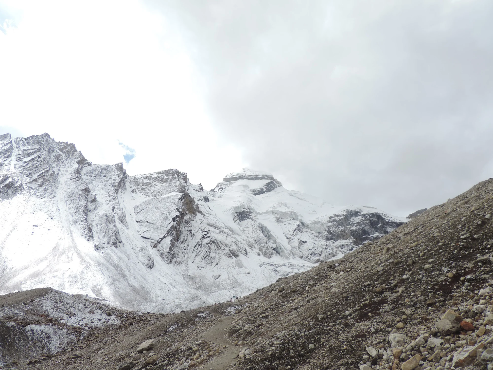
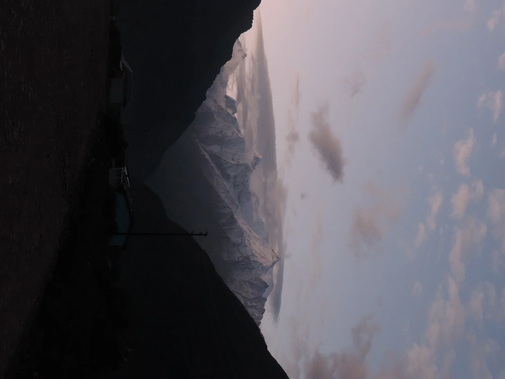
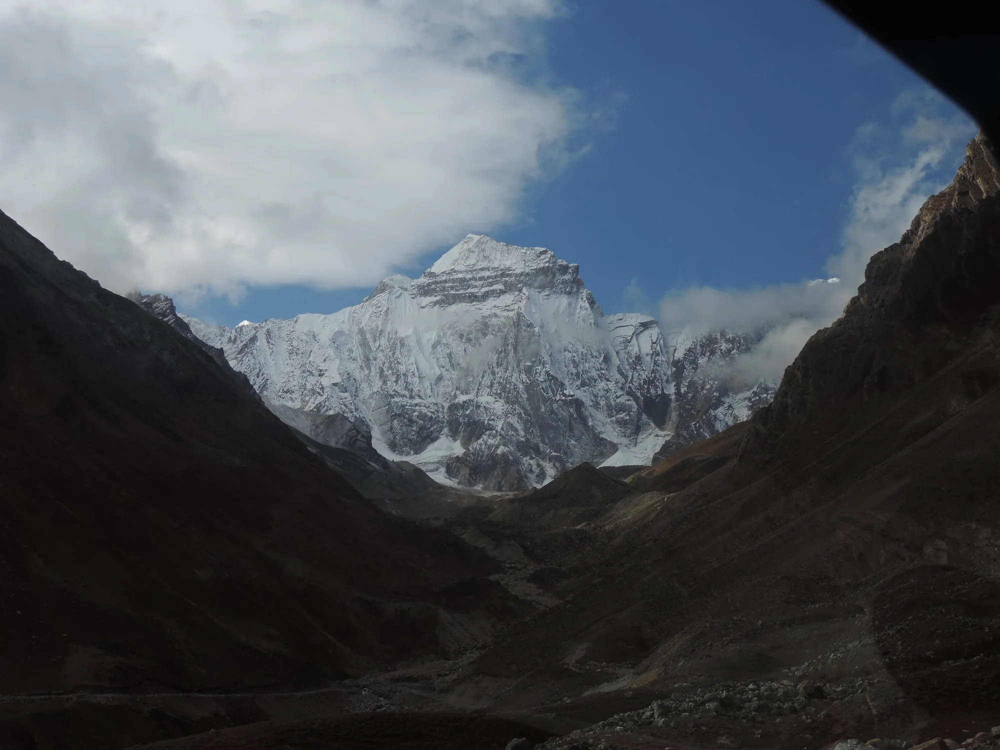
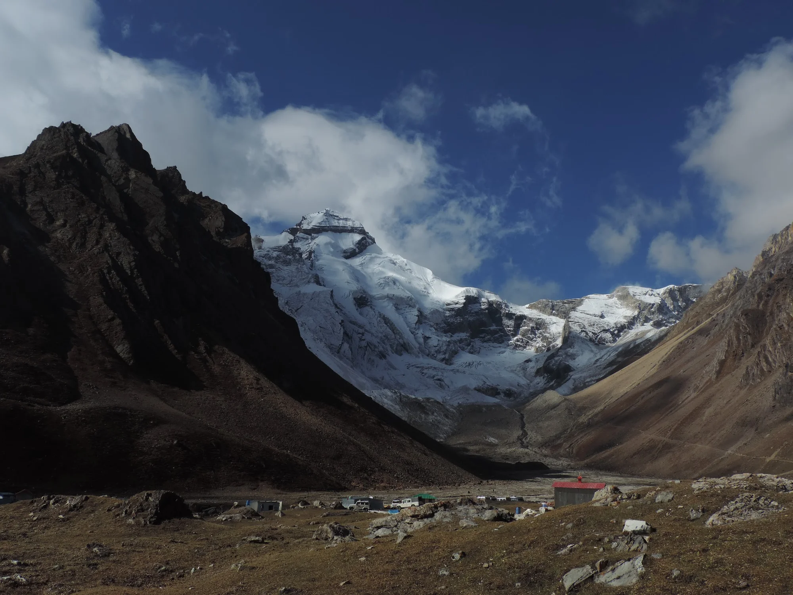
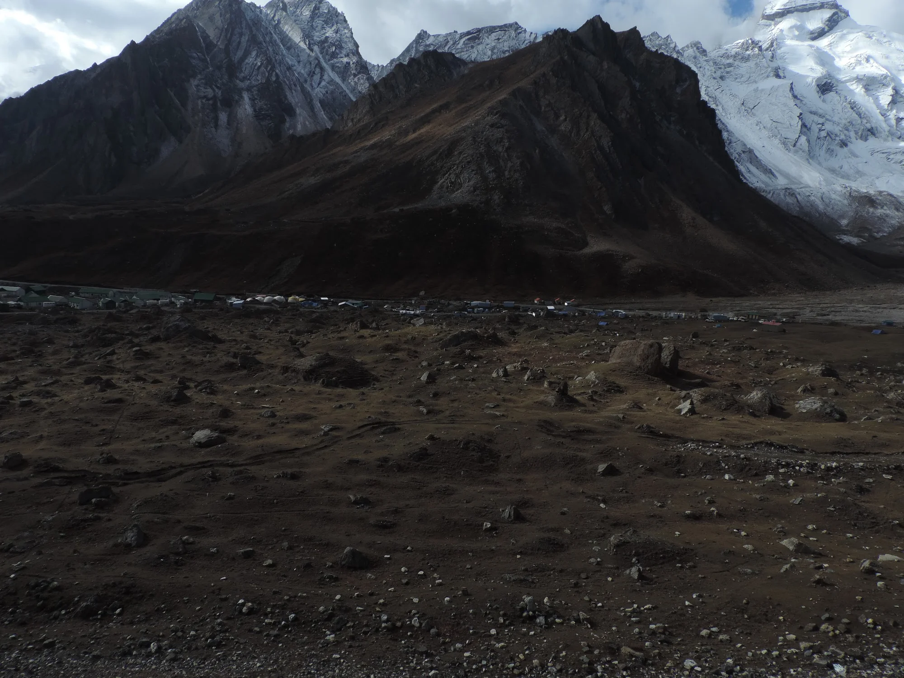
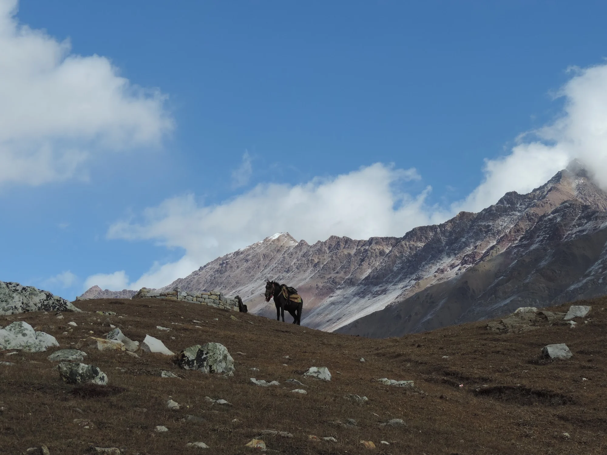

There are mountains that impress, and there are mountains that humble. Adi Kailash belongs firmly to the latter.

Hidden deep in the Kumaon Himalayas near the Indo-Tibetan border, Adi Kailash (also called Chhota Kailash) is revered as an earthly counterpart of Mount Kailash in Tibet. The journey is long, the roads unforgiving, and the weather unpredictable—but the reward is a landscape unlike any other.

:::note
The route requires an Inner Line Permit and is usually undertaken from Dharchula via Gunji and Kutti. Weather and road conditions can change rapidly, especially after the monsoon.
:::

## Into the High Himalayas

The road climbs steadily from lush valleys into an increasingly stark landscape. Forests gradually disappear, replaced by rocky slopes carved by glaciers and rivers.

Every turn seems to reveal another massive wall of snow and ice, each peak appearing more dramatic than the last.

The scale is difficult to appreciate until you're standing there. The mountains don't simply rise—they dominate everything around them.

## Dawn at Gunji

One of the unexpected highlights of the journey was waking up before sunrise in Gunji.

The valley remained almost completely silent as the first light slowly painted the distant snow-covered ridges in shades of blue and pink.

It was one of those rare mornings where nothing needed to be said. Everyone simply stood outside watching the mountains wake up.

## The First Sight of Adi Kailash

After hours of driving through narrow mountain roads, the iconic pyramid-like summit finally emerged through the clouds.

The first glimpse is unforgettable.

Unlike many famous Himalayan viewpoints crowded with tourists, this one felt remarkably peaceful. The mountain stood alone above the valley, partially veiled by drifting clouds.

## At the Foot of the Sacred Mountain

The landscape around Adi Kailash is surprisingly barren.

There are no dense forests or colourful meadows here—only rocky moraines, scattered settlements, and enormous glaciers feeding streams into the valley below.

The simplicity of the terrain somehow makes the mountain itself even more striking.

:::tip
Clear mornings generally offer the best chance of an unobstructed view. Clouds often gather quickly by afternoon.
:::

## Life at High Altitude

Despite the harsh conditions, small settlements continue to exist in these remote valleys.

Tiny houses, pilgrims, army vehicles, and local residents all share the same dramatic backdrop beneath towering Himalayan peaks.

The contrast between everyday life and the immense surrounding landscape is remarkable.

## The Quiet Companions

Even the pack animals seemed perfectly at home in this rugged environment.

A lone mule waiting patiently against a backdrop of snow-covered ridges became one of the simplest yet most memorable photographs from the trip.

Out here, movement slows naturally. Distances are measured less by kilometres and more by changing landscapes, shifting clouds, and the rhythm of the mountains.

## Reflections

Adi Kailash isn't a destination that overwhelms with dramatic tourist infrastructure or endless viewpoints. Its appeal lies in its stillness.

The silence, the high-altitude desert, and the immense snow-covered peaks create an atmosphere that's difficult to describe but easy to remember.

Long after the journey ends, it's this feeling—not just the photographs—that stays with you.