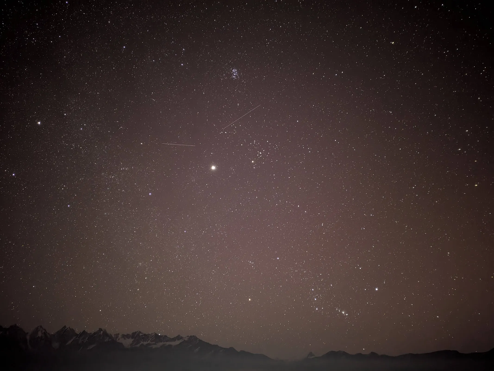
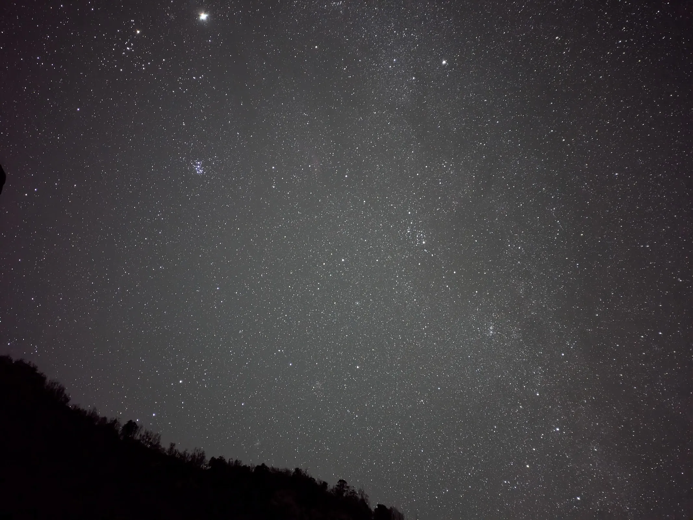
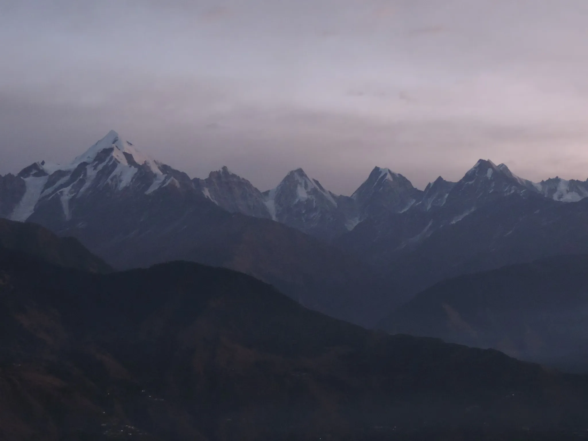
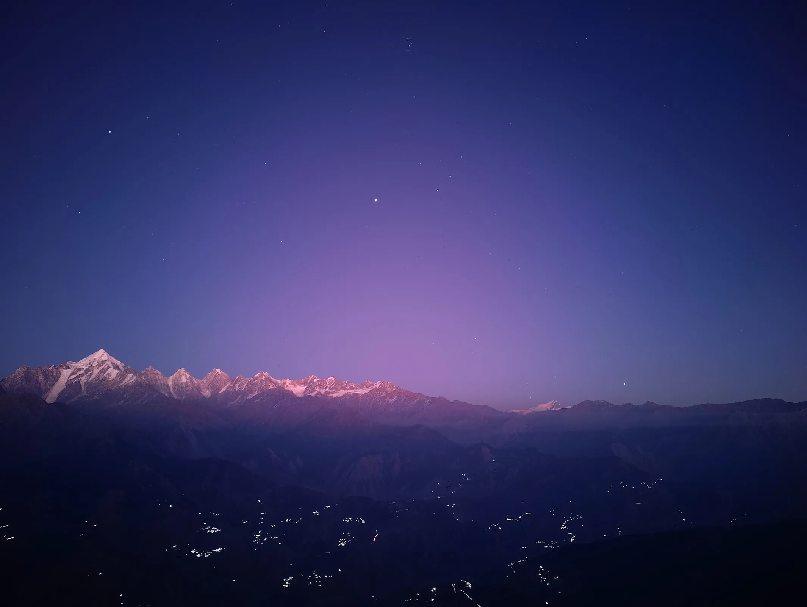
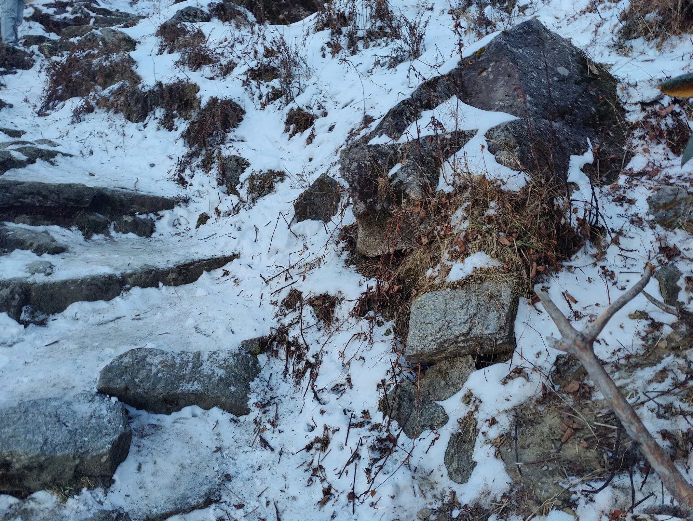
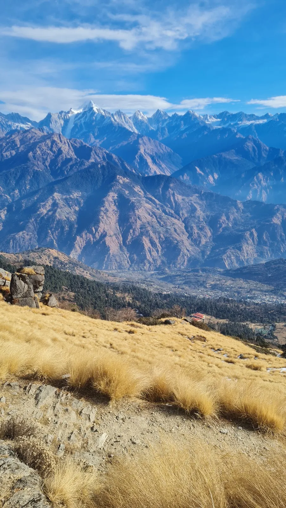
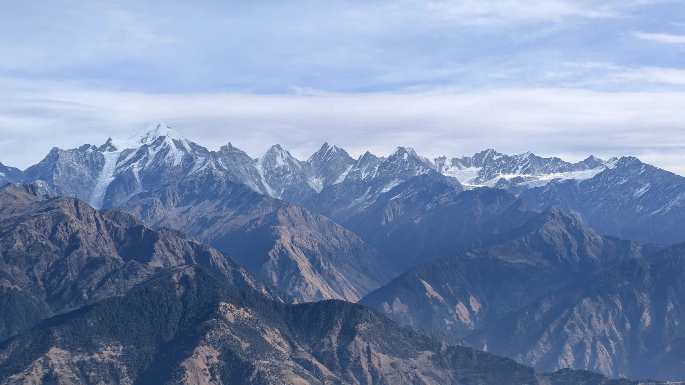
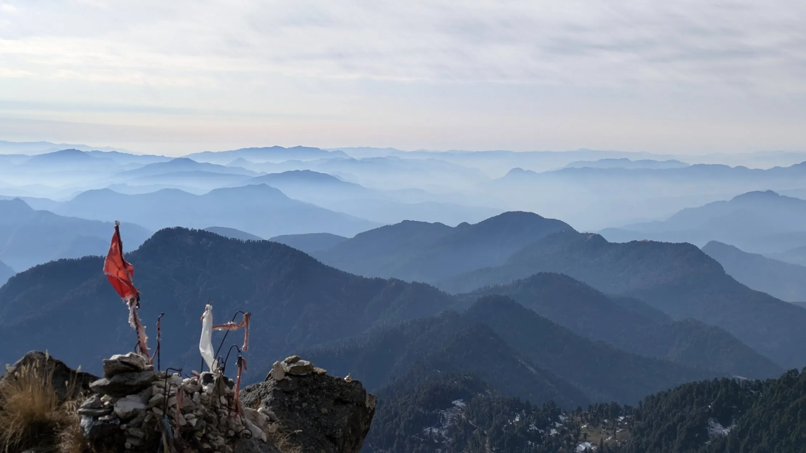
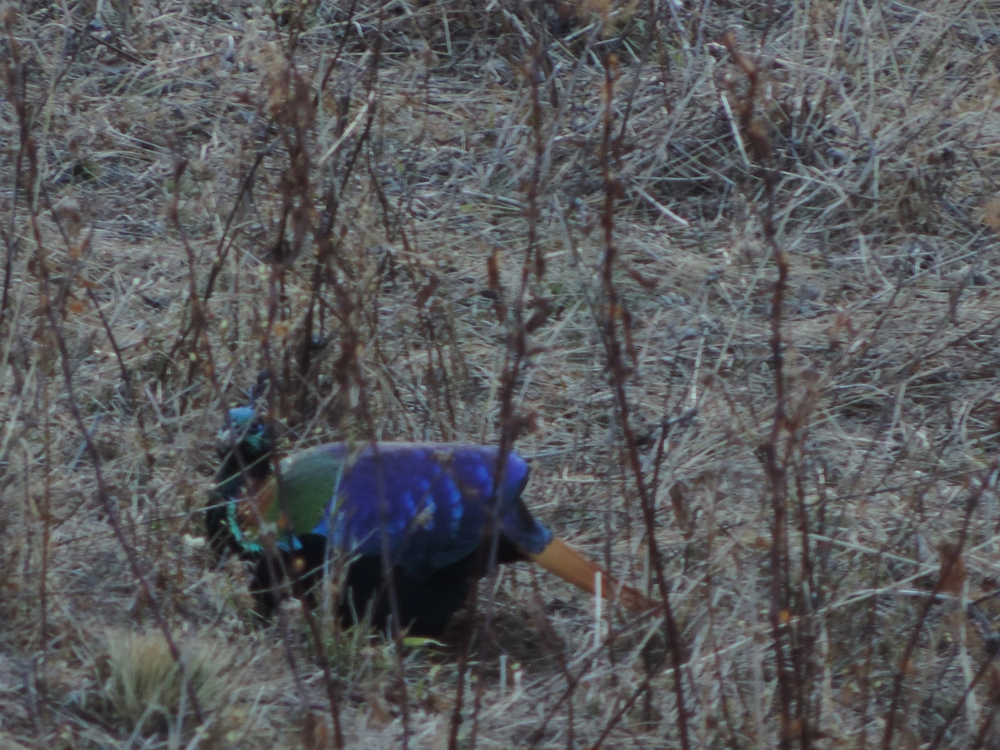
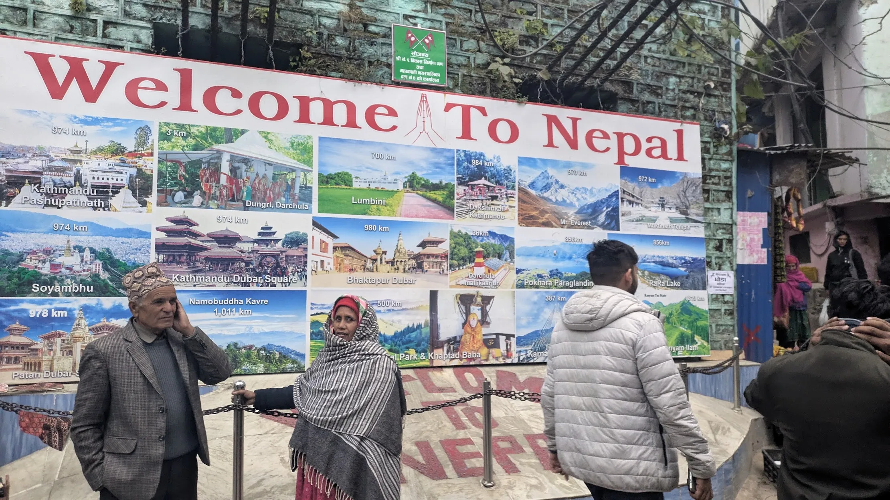

## Into the Kumaon Himalayas

Nestled in the Pithoragarh district of Uttarakhand, **Munsyari** is often called the *Gateway to Johar Valley*. Surrounded by snow-capped peaks and dense forests, it's one of those places that immediately makes you slow down. The town is best known for its breathtaking views of the **Panchachuli** massif and serves as the starting point for several Himalayan expeditions.

Our destination was **Khaliya Top**, a relatively short but incredibly rewarding trek that climbs to nearly **3,500 m** above sea level. During winter, the trail transforms into a snowy wonderland, making the journey just as memorable as the destination.

:::note[Quick Facts]

**📍 Destination:** Munsyari, Uttarakhand  
**🥾 Trek:** Khaliya Top  
**⛰️ Elevation:** ~3,500 m  
**🚶 Difficulty:** Easy–Moderate  
**❄️ Best Time:** December–March (snow), April–June (pleasant weather)  
**📷 Highlights:** Panchachuli views, astrophotography, alpine meadows, Himalayan Monal

:::

## A Sky Full of Stars

One of the biggest highlights of the trip wasn't during the day—it began after sunset.

Far away from city lights, Munsyari revealed one of the darkest skies I've ever experienced. The Milky Way stretched faintly across the horizon while familiar winter constellations slowly emerged overhead. **Jupiter** shone brilliantly beside the **Pleiades**, while Orion gradually climbed higher as the night went on.

Standing outside in freezing temperatures with a camera and tripod wasn't exactly comfortable, but moments like these make you forget about the cold.

The night wasn't entirely still either. During a few long exposures, a couple of satellites quietly drifted across the frame. It's fascinating how alive the night sky feels once your eyes adjust to the darkness.

:::tip[Astrophotography Tips]

- Visit during a **new moon** whenever possible.
- A sturdy tripod is indispensable.
- Carry spare batteries—winter temperatures drain them surprisingly fast.
- A fast wide-angle lens (f/2.8 or faster) makes capturing the Milky Way much easier.

:::

## Sunrise and Sunset over Panchachuli

The mountains offered us two completely different moods over the course of the trip.

The first morning began well before sunrise. As reluctant as we were to leave the warmth of our rooms, the effort paid off almost immediately. The first rays of sunlight slowly painted the snow-covered Panchachuli peaks in delicate shades of pink and orange before they transitioned into brilliant white under the morning sun. Watching the mountains wake up in complete silence was one of the most peaceful moments of the entire trip.

Later that evening, the same peaks wore an entirely different character. The fading sunlight softened the landscape into muted blues and warm amber tones, and the bustling excitement of the day quietly gave way to stillness. If sunrise felt like a promise of adventure, dusk felt like a gentle reminder to pause, breathe, and simply admire where the journey had brought us.

:::note[About Panchachuli]

The **Panchachuli** massif consists of five prominent Himalayan peaks. According to local folklore, the name translates to **"Five Cooking Hearths"**, believed to be the place where the Pandavas cooked their final meal before beginning their journey towards heaven.

:::

## Trekking to Khaliya Top

The trail begins gently through forests before gradually opening into vast alpine meadows. Winter had left patches of snow and ice along much of the route, making trekking poles surprisingly useful.

Fortunately, the climb isn't technically demanding, allowing plenty of opportunities to stop, take photographs, and simply appreciate the scenery.

As we gained altitude, the forests slowly disappeared behind us, replaced by vast alpine meadows blanketed in winter's quiet embrace. Every turn of the trail seemed to reveal a wider horizon than the last. The silence was almost tangible—broken only by the crunch of snow beneath our boots and the occasional mountain breeze sweeping across the ridges.

Standing there, it became difficult to think about destinations at all. The mountains have a curious way of shifting one's attention away from the summit and back toward the simple act of walking. Every ridge invited another, every valley hinted at another hidden trail, and for a brief moment the world felt impossibly vast, yet wonderfully uncomplicated.

Some landscapes seem to resist photographs. No matter how wide the lens or how carefully composed the frame, they never quite capture the feeling of actually standing there. Looking across the endless layers of Himalayan ridges, I was reminded of Friedrich Nietzsche's words:

> *The mountains are calling.*  

No—that was John Muir. Nietzsche instead wrote:

> *He who climbs upon the highest mountains laughs at all tragedies, real or imaginary.*

Whether or not one agrees with his philosophy, there is something profoundly liberating about mountain journeys. They reduce life's constant noise to its essentials: one step after another, one breath after another. Up there, the mountains seem indifferent to our ambitions, yet strangely capable of putting them into perspective.

:::tip[Trekking Tips]

- Dress in **multiple layers** instead of one heavy jacket.
- Sunglasses are highly recommended when trekking over snow.
- Carry at least 1–2 litres of water even during winter.
- Start early to enjoy both the morning light and quieter trails.

:::

## An Unexpected Encounter

The Himalayas aren't just about dramatic landscapes—they're also home to remarkable wildlife.

While walking through one of the quieter sections of the trail, we were fortunate enough to spot a **Himalayan Monal** quietly foraging nearby. Its iridescent feathers shimmered between green, blue, copper, and violet depending on the angle of the sunlight.

It was one of those unexpected moments that no itinerary can really plan for.

:::note[The Himalayan Monal]

The **Himalayan Monal (*Lophophorus impejanus*)** is the **state bird of Uttarakhand**. The male is widely regarded as one of the most colourful pheasants in the world, while the female has much subtler plumage that helps it remain camouflaged.

:::

## A Short Detour into Nepal

Since Munsyari lies fairly close to the Indo–Nepal border, we decided to make a short detour into Nepal during the trip.

Crossing into another country within the span of a day felt surprisingly surreal. Although the surrounding mountains remained familiar, the language, markets, and everyday life immediately gave the place a different character.

Perhaps the most memorable part, though, was that this little detour quietly became **my first-ever foreign trip**. It wasn't a journey that involved long flights or passport stamps from faraway continents, but somehow that made it even more special. My first experience outside India happened not in a bustling international airport, but amidst the serenity of the Himalayas.

:::tip[Border Visit]

Always carry a valid government-issued ID and check the latest border regulations before planning a cross-border visit, as entry requirements can change over time.

:::

## Looking Back

Khaliya Top turned out to be much more than a simple winter trek. Every part of the journey offered something memorable—the peaceful forests, snow-covered meadows, brilliant Himalayan sunrises, crystal-clear night skies, and even an unexpected encounter with the Himalayan Monal.

What began as a trip to see the Panchachuli peaks quickly became one of my favourite mountain experiences. Munsyari strikes a rare balance between accessibility and remoteness. It has enough infrastructure to make travelling comfortable while still preserving the feeling of being deep in the Himalayas.

Whether you're a trekker chasing panoramic views, a photographer hoping to capture the Milky Way, or simply someone looking for a quiet escape into the mountains, **Khaliya Top** is a destination that's difficult to forget.

It's certainly a place I'd love to return to—preferably on another cold, cloudless winter night beneath those unforgettable Himalayan skies.