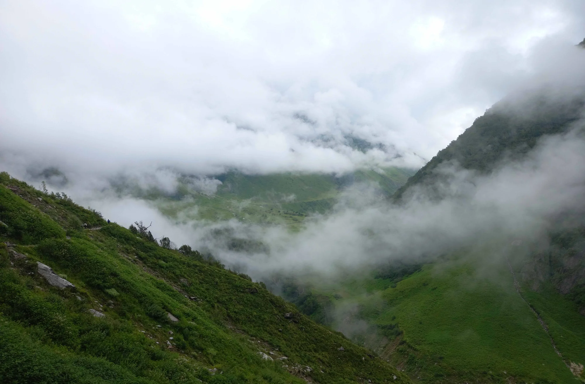
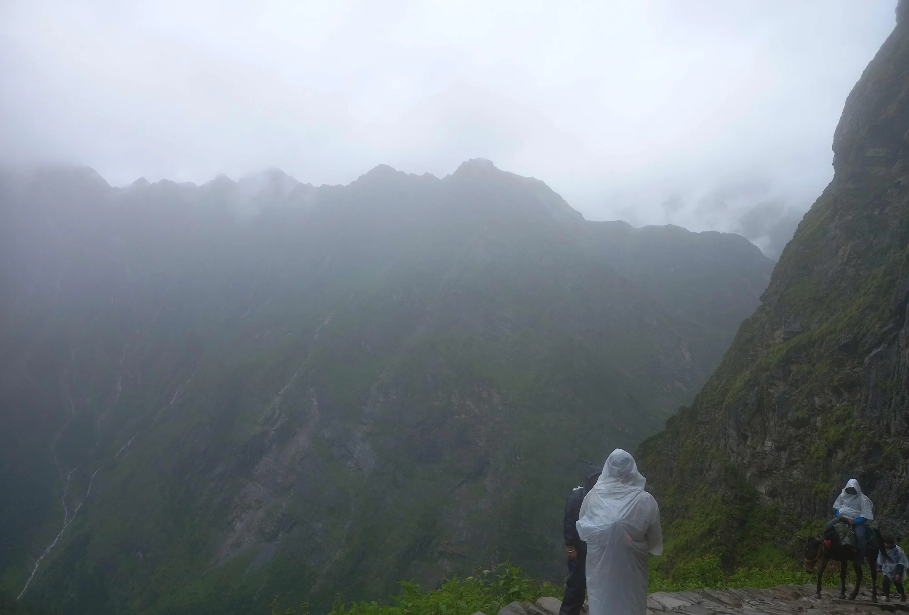
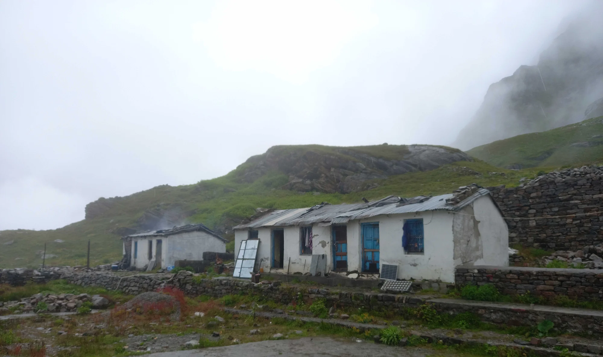
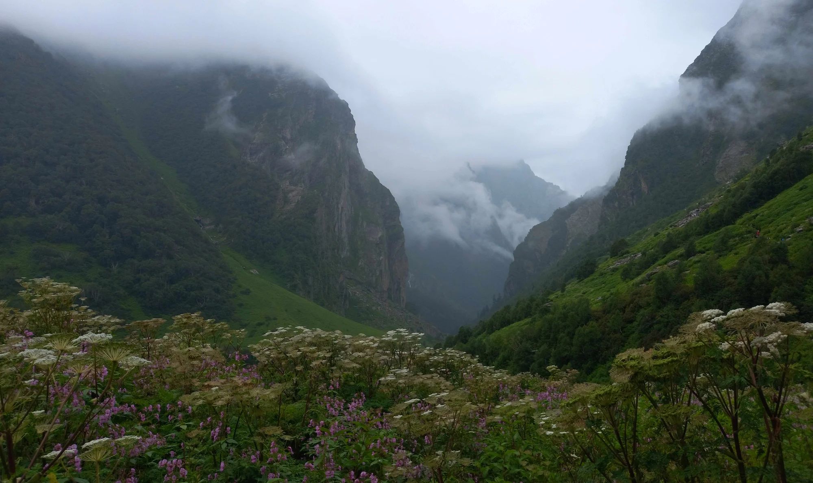
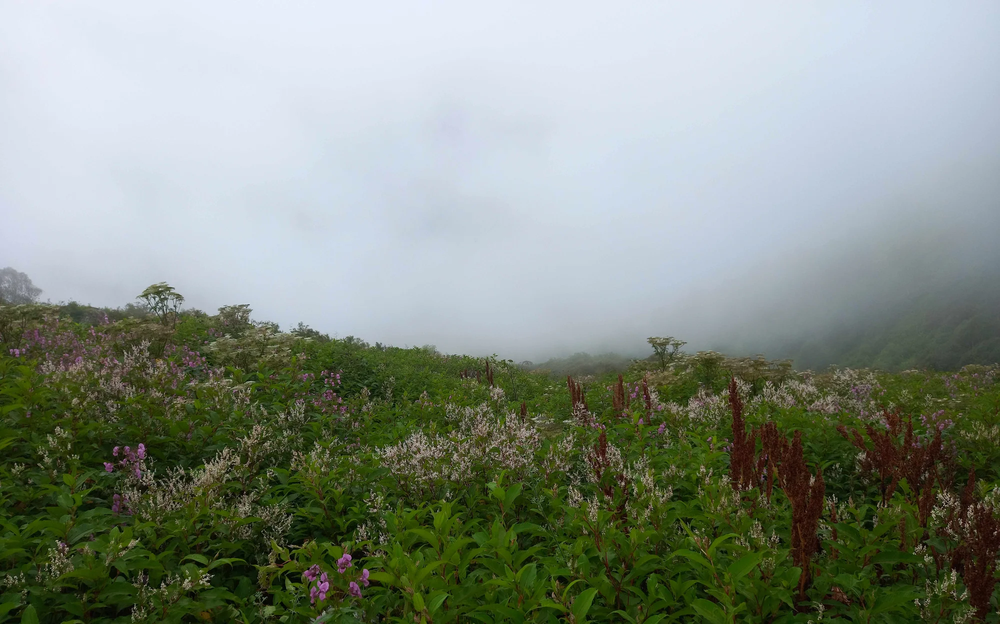
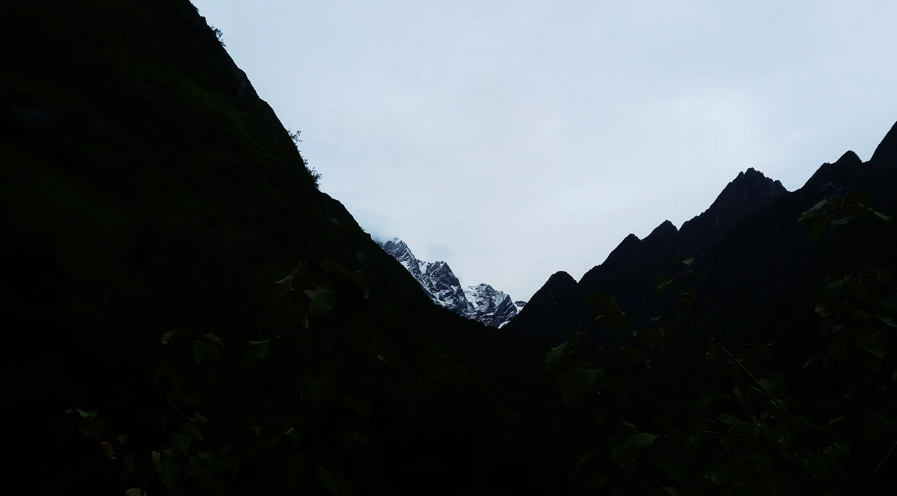

## The Journey Begins

Some treks reward you with a spectacular view at the end.

The Valley of Flowers rewards you at every turn.

Tucked away in the Chamoli district of Uttarakhand, the Valley of Flowers is a UNESCO World Heritage Site famous for its alpine meadows that burst into colour during the monsoon months. Hidden beneath snow for nearly seven months of the year, the valley comes alive only for a brief window between July and September, when hundreds of species of Himalayan flowers bloom simultaneously.

The trek begins from **Govindghat**, following the Alaknanda River to the small village of **Ghangaria**—the last inhabited settlement before the paths diverge towards either the Valley of Flowers or Hemkund Sahib.

The first day was almost entirely rain.

Clouds drifted across the mountains so quickly that entire hillsides disappeared and reappeared within minutes. Every now and then the mist would lift just enough to reveal steep green slopes carved by countless waterfalls before swallowing them once again.

:::note
The Valley of Flowers lies at an elevation of approximately **3,600 metres (11,800 ft)** inside the Nanda Devi Biosphere Reserve. The park covers nearly **88 square kilometres** and is home to hundreds of alpine plant species, many of which bloom only during the short Himalayan summer.
:::

## Walking Through the Clouds

As the trail climbed higher, the landscape began to change.

Dense forests gradually gave way to rocky cliffs and alpine grasslands. The rain never really stopped; instead, it alternated between a light drizzle and heavy showers that wrapped the mountains in an almost dreamlike haze.

Visibility often dropped to only a few hundred metres.

Yet somehow that only made the scenery more dramatic.

The route is shared by hikers, pilgrims heading towards Hemkund Sahib, mule caravans carrying supplies, and local porters who somehow navigate the steep mountain paths with astonishing ease.

Watching them effortlessly climb slopes that left most visitors breathless was humbling.

:::tip
At these elevations, the reduced oxygen makes even gentle climbs feel surprisingly strenuous. Most trekkers spend a night at Ghangaria before attempting either the Valley of Flowers or Hemkund Sahib to acclimatize.
:::

## Life Above the Tree Line

The weather in the Himalayas has a personality of its own.

Within a single hour the sky can shift from bright sunshine to heavy rain, dense fog, and back again.

The small settlements scattered along the trail reflect this reality. Simple stone buildings with corrugated metal roofs provide shelter for pilgrims, trekkers and locals alike. They may not look luxurious, but after hours of walking in the rain, they feel remarkably welcoming.

Despite the harsh climate, people have lived and travelled through these mountains for centuries, adapting to conditions that change almost daily.

## The Valley Reveals Itself

Eventually, the narrow mountain trail opens into something entirely unexpected.

Instead of a steep rocky landscape, an enormous alpine meadow stretches across the valley floor, framed by towering cliffs whose peaks remain hidden behind drifting clouds.

During peak flowering season, the valley transforms into a natural mosaic of colour.

More than **500 species of flowering plants** have been documented here, including Himalayan balsam, blue poppies, cobra lilies, primulas, anemones, orchids and countless wildflowers that bloom for only a few weeks each year.

The valley owes its modern fame largely to British mountaineer **Frank Smythe**, who stumbled upon it in 1931 after returning from an expedition to Kamet. Captivated by the landscape, he later wrote a book titled *The Valley of Flowers*, introducing this hidden Himalayan meadow to the rest of the world.

:::note
Although Frank Smythe popularized the valley internationally, local communities had known about it for generations. Numerous myths and folk stories describe it as a place inhabited by fairies and divine beings.
:::

## A Landscape That Never Looks the Same Twice

One of the most remarkable aspects of the Valley of Flowers is that no two visits are ever identical.

The flowers bloom in waves throughout the monsoon season.

Visit in early July and the valley looks completely different from late August. Different species dominate at different times, constantly changing the colours spread across the landscape.

Even the weather becomes part of the experience.

At one moment distant peaks appear crystal clear.

Minutes later they disappear behind moving curtains of cloud.

The constantly shifting light makes the valley feel less like a destination and more like a living landscape.

## Leaving the Mountains

The return journey felt strangely different.

The same valleys that had seemed mysterious on the way up now felt familiar.

Occasionally the clouds parted just enough to reveal snow-covered peaks hidden beyond the ridgelines, offering a final reminder of how immense the Himalayas really are.

Long after the photographs fade from memory, what remains is not a single viewpoint or landmark.

It is the feeling of walking through clouds, hearing distant waterfalls long before seeing them, and watching entire mountains appear and disappear with the changing weather.

The Valley of Flowers is often described as one of India's most beautiful treks.

After walking through it, that description feels less like praise and more like a simple statement of fact.