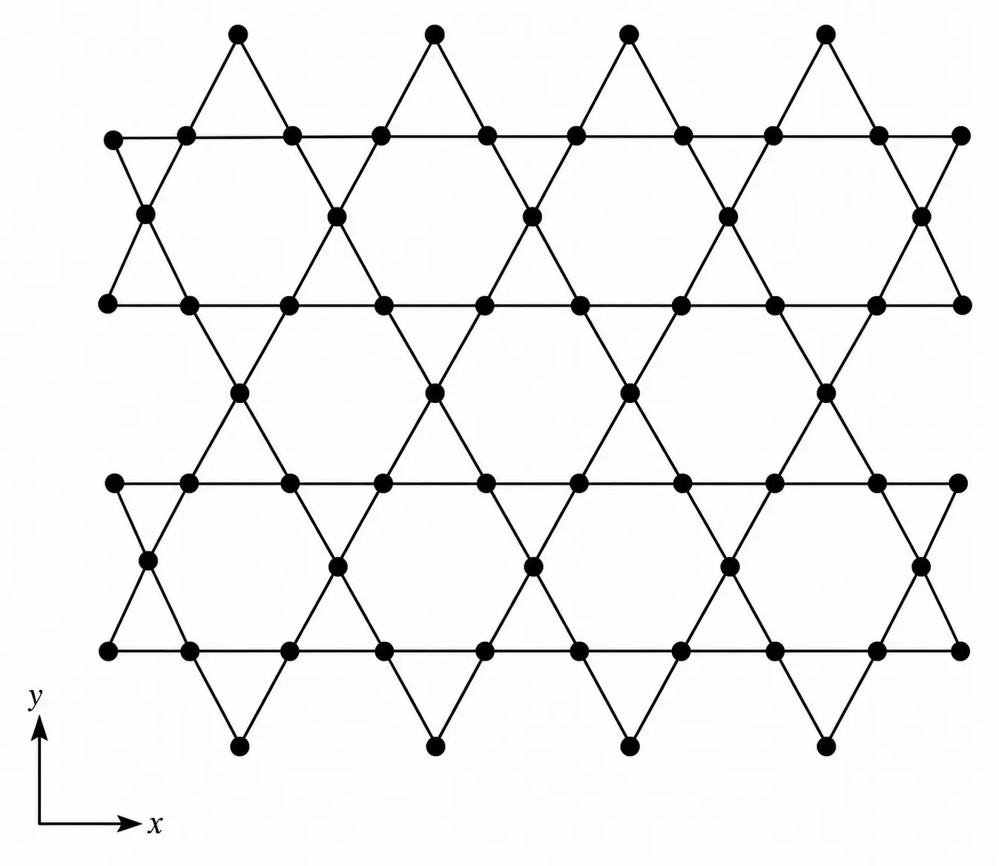
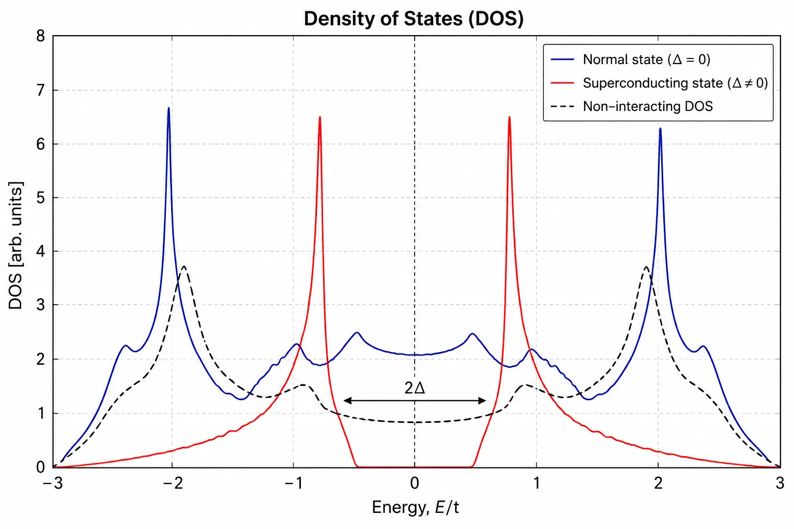
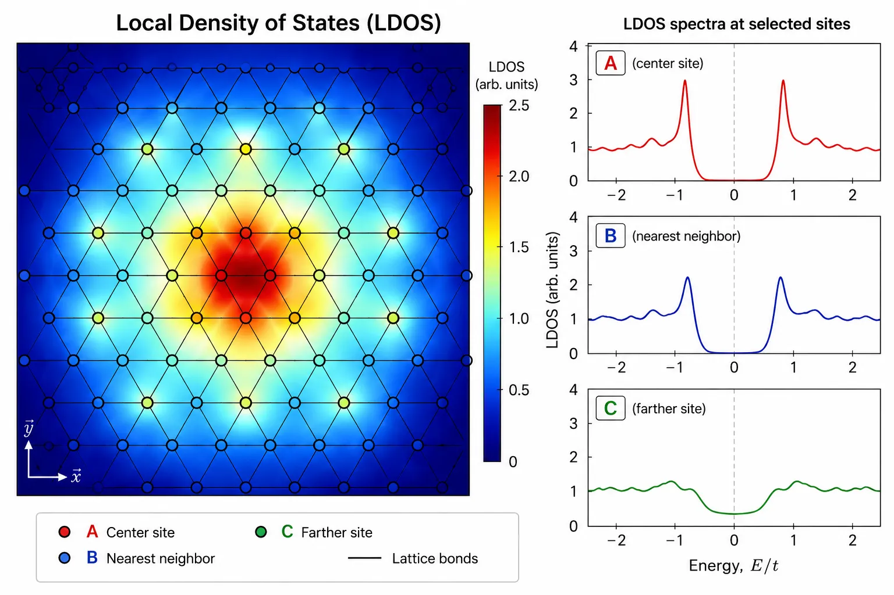
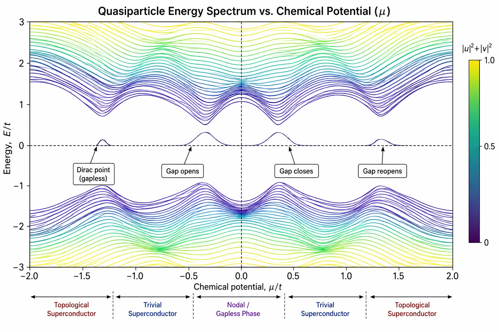
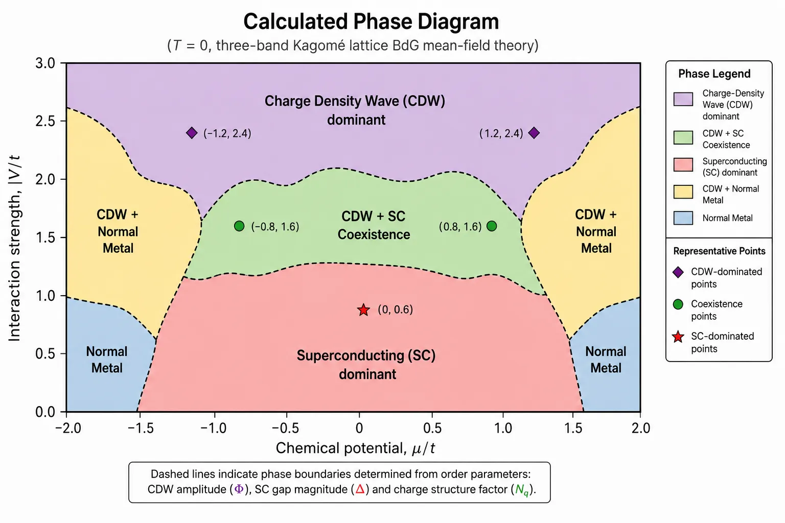

<a href="https://drive.google.com/file/d/1mEX0if3uiUl5duGj5TjAwwMkHxhRgHer/view?usp=drivesdk" target="_blank" rel="noopener noreferrer">Link to thesis</a>

## Important Note
**This article was written and all the images were generated with the help of ChatGPT to faithfully and pedagogically reproduce my own work.**

## Problem

If you have taken a first course in solid state physics, you have almost certainly encountered superconductivity through the celebrated BCS theory. Two electrons with opposite momenta and spin form a Cooper pair, an energy gap opens at the Fermi surface, electrical resistance vanishes, and magnetic fields are expelled from the material. It is an elegant theory—and one of the greatest achievements of twentieth-century physics.

Yet nature rarely settles for elegance alone.

Over the last few decades, an entire family of materials has emerged whose superconducting properties refuse to fit neatly into the conventional BCS framework. High-temperature cuprates, iron pnictides, heavy fermion compounds, twisted graphene, and more recently, **Kagomé metals**, all exhibit strong electronic correlations and competing ordered phases that challenge our understanding of superconductivity.

Among these materials, the AV$_3$Sb$_5$ family (A = K, Rb, Cs) has become particularly fascinating. Shortly after its discovery, experiments revealed an unusual combination of electronic phenomena occurring within the same material:

- superconductivity,
- charge density wave (CDW) order,
- anomalous Hall response,
- nematicity,
- possible time-reversal symmetry breaking,
- and signatures of non-trivial band topology.

Each of these phenomena is individually interesting. Observing all of them simultaneously raises an obvious question:

> **Are these electronic phases independent, or are they manifestations of the same underlying physics?**

Understanding that relationship is far from straightforward.

Unlike conventional superconductors, where the pairing mechanism is comparatively well understood, Kagomé superconductors host several competing interactions operating on similar energy scales. Charge ordering modifies the electronic structure. Superconductivity attempts to establish long-range phase coherence. Flat bands amplify electron correlations, while Dirac cones introduce relativistic quasiparticles into the low-energy spectrum.

The resulting phase diagram is remarkably rich.

:::note
One of the remarkable features of modern condensed matter physics is that many-body systems often organize themselves into entirely new phases of matter. Instead of studying individual electrons, we study the **collective behaviour** that emerges when billions of interacting particles cooperate.
:::

This project was motivated by a simple objective:

> **Can a microscopic theoretical model reproduce the experimentally observed coexistence of superconductivity and charge density wave order in Kagomé metals, and what does that reveal about the nature of the superconducting state?**

To answer this question, I employed a self-consistent **Bogoliubov–de Gennes (BdG)** framework built upon a three-band tight-binding model of the Kagomé lattice. Rather than assuming the superconducting order parameter, the model allows it to emerge naturally from the underlying electronic interactions.

The calculations presented here formed the basis of my Master's thesis at the Indian Institute of Technology Roorkee under the supervision of **Dr. Narayan Mohanta**.

### Exploring the Unknown: Why Kagomé?

The word *Kagomé* originates from a traditional Japanese bamboo weaving pattern (*籠目*), whose repeating arrangement of triangles inspired the name of the lattice.

At first glance, the geometry appears deceptively simple.

Three atoms occupy every unit cell, arranged as corner-sharing triangles.



Unlike square or honeycomb lattices, however, this geometry introduces **geometric frustration**—a situation where neighbouring interactions cannot all be simultaneously satisfied.

Geometric frustration has profound consequences.

Instead of producing ordinary electronic bands, the Kagomé lattice naturally generates three striking features:

1. **Dirac cones**, where quasiparticles behave like relativistic fermions.
2. **Van Hove singularities**, where the density of states diverges.
3. **Nearly flat bands**, where electrons possess extremely small kinetic energy.

Each feature alone has important physical consequences.

Together, they create one of the richest electronic structures known in condensed matter physics.

:::tip
Whenever kinetic energy becomes small compared to interaction energy, electrons become far more sensitive to one another. Strong correlations, magnetism and unconventional superconductivity frequently emerge in precisely this regime.
:::

The electronic structure can be understood by beginning with the tight-binding approximation,

$$ H_{\mathrm{TB}} = -\sum_{\langle ij\rangle,\sigma}
t_{ij}
c_{i\sigma}^{\dagger}
c_{j\sigma}
-\mu
\sum_{i\sigma}
n_{i\sigma} $$

where $t_{ij}$ represents electron hopping between neighbouring lattice sites and $\mu$ denotes the chemical potential.

Although deceptively compact, this Hamiltonian already captures much of the remarkable physics of the Kagomé lattice.

Diagonalising it reveals multiple bands crossing the Fermi energy together with symmetry-protected Dirac points and an almost dispersionless flat band.

The flat band deserves special attention.

Unlike ordinary electronic bands, whose energy varies with momentum, a perfectly flat band has almost no dispersion,

$$
E(\mathbf{k}) \approx \text{constant}.
$$

This implies an exceptionally large density of available electronic states within a narrow energy window.

Consequently, even relatively weak electron-electron interactions may drive dramatic changes in the ground state, giving rise to superconductivity, charge ordering or spontaneous symmetry breaking.

In AV$_3$Sb$_5$, the situation becomes even more intriguing.

Experiments have demonstrated that before the material becomes superconducting, it first develops a **charge density wave**.

Instead of maintaining a uniform electronic density,

$$ n(\mathbf r)=n_0,
$$

the electrons spontaneously reorganize into a periodic modulation,

$$ n(\mathbf r) = n_0+\delta n \cos(\mathbf Q\cdot\mathbf r), $$

where $\mathbf Q$ denotes the ordering wavevector.

This new periodicity reconstructs the Fermi surface and dramatically alters the low-energy electronic spectrum.

Whether this reconstruction suppresses superconductivity or instead helps stabilize unconventional pairing remains one of the central questions surrounding Kagomé metals.

:::warning
Charge density waves and superconductivity often compete because both attempt to gap the same electronic states near the Fermi surface. Surprisingly, AV$_3$Sb$_5$ appears capable of hosting both simultaneously.
:::

Understanding this coexistence requires a framework capable of treating superconductivity and charge ordering on equal footing.

That framework is provided by the **Bogoliubov–de Gennes equations**.

## What's the BdG Framework?

Every theory begins by choosing the correct language.

For conventional metals, individual electrons provide an adequate description.

For superconductors, however, electrons cease to behave independently.

Near the Fermi surface they bind into **Cooper pairs**, forming a coherent quantum condensate extending throughout the crystal.

Describing such a system requires more than ordinary single-particle quantum mechanics.

Instead of solving for individual electrons, the Bogoliubov–de Gennes (BdG) formalism describes **quasiparticles**—quantum excitations that are coherent superpositions of electrons and holes.

The transformation,

$$ \gamma_n  =
u_n c
+
v_n c^\dagger,
$$

mixes particle and hole degrees of freedom into new elementary excitations.

Physically, this means that adding one quasiparticle to a superconductor is no longer equivalent to adding a single electron.

The superconducting condensate acts as a quantum reservoir from which particles may be borrowed and returned.

This seemingly abstract mathematical construction produces one of the most successful microscopic descriptions of superconductivity.

Instead of postulating an energy gap, the BdG formalism determines it **self-consistently**.

Starting from an initial guess for the superconducting order parameter,

$$
\Delta_i,
$$

the Hamiltonian is diagonalized to obtain the quasiparticle wavefunctions.

Those wavefunctions are then used to compute a new value of $\Delta_i$.

The process repeats until successive iterations no longer change the solution.

```text
Initial Guess
      │
      ▼
Construct BdG Hamiltonian
      │
      ▼
Diagonalize
      │
      ▼
Compute new order parameters
      │
      ▼
Converged?
      │
 ┌────┴─────┐
 │          │
No         Yes
 │          │
 └──────────┘
```

This iterative procedure is known as **self-consistency**, and it lies at the heart of nearly every microscopic calculation presented throughout this project.

:::note
The BdG formalism does not force superconductivity into the model. Instead, it asks a more interesting question: *if superconductivity exists, what form is energetically preferred by the underlying electronic interactions?*
:::

For materials such as AV$_3$Sb$_5$, where several ordered phases coexist, this self-consistent approach becomes particularly powerful.

Rather than treating superconductivity and charge ordering separately, both emerge simultaneously from the same microscopic Hamiltonian, allowing one to investigate how they compete, reinforce one another, or produce entirely new phases that would be difficult to anticipate from phenomenological models alone.

In the next section, we construct the full microscopic Hamiltonian used throughout this work and show how superconductivity, charge density waves and electronic interactions are incorporated into a unified theoretical framework.

### Building the Microscopic Picture

The previous section painted the broad picture: Kagomé metals exhibit an unusual coexistence of superconductivity, charge density waves, and strong electronic correlations. To understand why these phases appear—and more importantly, why they sometimes coexist—we require a microscopic model capable of describing all of them simultaneously.

The philosophy behind the model is surprisingly simple.

Rather than attempting to simulate every electron inside a real crystal, we identify only the **low-energy electronic degrees of freedom** responsible for the observed physics. These electrons live close to the Fermi surface and dominate transport, superconductivity, and collective ordering.

Everything else can be integrated out.

The resulting Hamiltonian is dramatically simpler than the full many-body Schrödinger equation while retaining the essential physics.

### The Tight-Binding Hamiltonian

The electronic structure of AV$_3$Sb$_5$ is remarkably well captured by a **three-band tight-binding model** defined on the Kagomé lattice.

Within this approximation, electrons hop between neighbouring lattice sites with amplitudes determined by the crystal geometry.

The kinetic part of the Hamiltonian is written as

$$ H_0 = -\sum_{\langle ij\rangle,\sigma}
t_{ij}
c_{i\sigma}^{\dagger}
c_{j\sigma} -
\mu
\sum_{i,\sigma}
n_{i\sigma},
$$

where

- $t_{ij}$ denotes the hopping strength,
- $\mu$ is the chemical potential,
- $c^\dagger_{i\sigma}$ creates an electron at lattice site $i$,
- and $n_{i\sigma}=c^\dagger_{i\sigma}c_{i\sigma}$.

Although compact, this Hamiltonian already produces one of the defining characteristics of the Kagomé lattice: a multi-band electronic spectrum containing flat bands, Dirac cones, and van Hove singularities.

:::tip
In condensed matter physics, the choice of Hamiltonian is everything. Once the correct microscopic Hamiltonian is identified, every observable—from electrical conductivity to superconductivity—can, in principle, be derived from it.
:::

Of course, hopping alone cannot produce superconductivity.

Electrons must interact.

### Introducing Electron Interactions

Superconductivity emerges only because electrons attract one another under suitable conditions.

Instead of explicitly modelling phonons or more complicated interaction mechanisms, the effective interaction is introduced phenomenologically through an attractive pairing potential.

The interaction Hamiltonian may be written schematically as

$$
H_{\mathrm{int}} = -
V
\sum_{\langle ij\rangle}
c^\dagger_{i\uparrow}
c^\dagger_{j\downarrow}
c_{j\downarrow}
c_{i\uparrow},
$$

where $V$ represents the effective attractive interaction.

Immediately one encounters a problem.

Unlike the hopping Hamiltonian, this interaction contains **four fermionic operators**.

Such many-body terms cannot generally be diagonalized exactly for realistic systems.

This is where the mean-field approximation enters.

### Mean-Field Theory: Trading Complexity for Insight

One of the oldest tricks in theoretical physics is to replace a difficult interacting problem with a simpler effective one.

Instead of allowing every electron to interact simultaneously with every other electron, each electron experiences an **average field** generated by all the others.

Mathematically, the interaction term is decomposed as

$$
AB
\approx
A\langle B\rangle
+
\langle A\rangle B -
\langle A\rangle\langle B\rangle.
$$

Applying this decomposition to the pairing interaction naturally introduces the superconducting order parameter,

$$
\Delta_{ij} =
V
\langle
c_{j\downarrow}
c_{i\uparrow}
\rangle.
$$

This quantity deserves a moment of reflection.

Unlike ordinary observables such as density or magnetization, $\Delta$ does **not** measure the presence of individual electrons.

Instead, it measures the probability amplitude that two electrons form a Cooper pair.

It is therefore an order parameter describing an entirely new macroscopic quantum state.

:::note
Many ordered phases in condensed matter physics are characterized by an order parameter.

- Ferromagnets → magnetization
- Crystals → atomic displacement
- Charge density waves → density modulation
- Superconductors → Cooper-pair amplitude

The emergence of a non-zero order parameter signals spontaneous symmetry breaking.
:::

### From Electrons to Quasiparticles

After the mean-field decomposition, the Hamiltonian becomes quadratic in the fermionic operators.

This is precisely the form required for the Bogoliubov transformation.

Instead of electrons, the natural excitations become quasiparticles,

$$
\gamma_n =
u_n c
+
v_n c^\dagger.
$$

Notice something unusual.

The second term contains a **creation operator**.

In other words, a quasiparticle is simultaneously part electron and part hole.

This remarkable property lies at the heart of superconductivity.

The condensate no longer conserves particle number locally.

Instead, particles continuously exchange with the superconducting background.

Consequently, quasiparticles propagate very differently from electrons inside an ordinary metal.

### The Bogoliubov–de Gennes Hamiltonian

Collecting all contributions together produces the Bogoliubov–de Gennes Hamiltonian,

$$ H_{\mathrm{BdG}} = \begin{pmatrix} H_0 & \Delta \\\\ \Delta^\dagger & -H_0^\ast \end{pmatrix}. $$

This elegant block structure immediately reveals several important physical ideas.

The upper-left block describes electrons.

The lower-right block describes holes.

The off-diagonal blocks describe superconducting pairing.

Without superconductivity,

$$
\Delta=0,
$$

the two sectors become completely independent.

Once superconductivity develops, however, electrons and holes hybridize.

The resulting quasiparticles possess entirely new energy eigenvalues.

Diagonalizing this matrix therefore reveals the complete superconducting excitation spectrum.

### Self-Consistency

Unlike many textbook problems, the BdG Hamiltonian is **not known beforehand**.

Its matrix elements depend upon the superconducting order parameter,

$$
\Delta_{ij},
$$

which itself depends upon the eigenvectors obtained after diagonalization.

The calculation therefore becomes an iterative feedback loop.

```text
Guess Δ
    │
    ▼
Construct BdG Hamiltonian
    │
    ▼
Diagonalize
    │
    ▼
Calculate uₙ and vₙ
    │
    ▼
Update Δ
    │
    ▼
Repeat until convergence
```

This procedure continues until

$$
|\Delta^{(n+1)}-\Delta^{(n)}|
<
10^{-8},
$$

or another suitably chosen convergence criterion.

Only then can the solution be considered self-consistent.

:::tip
Self-consistency is one of the defining ideas of modern computational condensed matter physics. Density Functional Theory, Hartree-Fock theory and Bogoliubov–de Gennes theory all rely upon essentially the same iterative philosophy.
:::

## Numerical Implementation

Although the equations themselves appear compact, solving them numerically is computationally demanding.

Every iteration requires constructing a large complex Hermitian matrix whose dimension scales with

- the number of lattice sites,
- the number of electronic orbitals,
- spin,
- and particle-hole degrees of freedom.

The matrix must then be diagonalized to obtain every quasiparticle eigenvalue and eigenvector.

This process is repeated hundreds—sometimes thousands—of times until convergence.

Consequently, even relatively modest lattice sizes require substantial computational resources.

The calculations presented in this work were implemented in **Python**, making extensive use of efficient linear algebra routines for matrix construction and diagonalization.

Rather than searching directly for analytical solutions, the numerical approach allows one to explore broad regions of parameter space, varying quantities such as

- chemical potential,
- interaction strength,
- superconducting pairing,
- and charge-density-wave amplitude.

Each converged solution corresponds to a possible quantum ground state of the material.

The next challenge is deciding **what physical quantities should be extracted** from these solutions.

The eigenvalues alone reveal surprisingly little.

Instead, we calculate experimentally measurable observables—density of states, local density of states, superconducting order parameters, momentum-space correlations and phase diagrams—which allow direct comparison with modern spectroscopy and transport experiments.

In many ways, this is where the theoretical calculations become truly meaningful: the mathematics begins to make contact with the laboratory.

## From Mathematics to Physics

At this point we have a fully self-consistent solution of the BdG equations. For every choice of interaction strength, chemical potential, and lattice size, the calculation returns hundreds (or thousands) of quasiparticle eigenvalues together with their corresponding wavefunctions.

While this information completely characterizes the superconducting state, it is not particularly useful by itself.

A list of eigenvalues tells us very little about the underlying physics.

Instead, condensed matter physicists compute **physical observables**—quantities that either possess direct experimental significance or provide insight into the microscopic electronic structure.

Throughout this work, several such observables were calculated. Together they provide a detailed picture of how superconductivity develops on the Kagomé lattice and how it interacts with competing electronic orders.

### Density of States

Perhaps the most fundamental quantity is the **Density of States (DOS)**.

Rather than asking *where* electrons are located, the DOS asks a different question:

> **How many electronic states are available at a given energy?**

Mathematically,

$$
N(E) =
\sum_n
\delta(E-E_n),
$$

where the sum extends over every quasiparticle eigenvalue.

Since numerical calculations produce discrete eigenvalues, the delta function is broadened slightly,

$$
\delta(E-E_n)
\rightarrow
\frac{\eta}
{\pi[(E-E_n)^2+\eta^2]},
$$

producing a smooth spectrum suitable for visualization.



The DOS acts almost like a fingerprint of the electronic state.

For example,

- a normal metal possesses finite states at the Fermi energy,
- a conventional superconductor develops a symmetric energy gap,
- and topological superconductors frequently exhibit characteristic in-gap states.

Watching the DOS evolve while varying model parameters immediately reveals where superconductivity appears, disappears, or undergoes qualitative changes.

:::note
One of the earliest experimental confirmations of BCS theory came from tunnelling spectroscopy, where the measured conductance is directly proportional to the electronic density of states.
:::

### Looking Closer: Local Density of States

The DOS provides a global picture of the material.

Sometimes, however, the interesting physics occurs only locally.

For example,

- around impurities,
- near lattice defects,
- along domain walls,
- or close to vortex cores.

To resolve such spatial variations, one computes the **Local Density of States (LDOS)**,

$$
N_i(E) =
\sum_n
\left(
|u_n(i)|^2
\delta(E-E_n)
+
|v_n(i)|^2
\delta(E+E_n)
\right).
$$

Unlike the DOS, which averages over the entire lattice, the LDOS measures the electronic spectrum at an individual lattice site.



This quantity possesses particular experimental importance because it is precisely what is measured using **Scanning Tunnelling Microscopy (STM)**.

Rather than comparing abstract theoretical quantities with experiments, the BdG calculations generate observables that experimentalists can directly visualize.

This close connection between theory and experiment is one of the strengths of the BdG approach.

:::tip
Modern STM experiments are capable of resolving individual atomic sites. Consequently, even subtle spatial variations predicted theoretically may be experimentally observable.
:::

### Superconducting Order Parameter

Perhaps the most important quantity obtained from the self-consistent calculation is the superconducting order parameter itself.

Initially,

$$
\Delta
$$

is simply an unknown variable.

After convergence, however, it becomes one of the principal results of the calculation.

Its magnitude determines the strength of superconductivity, while its phase contains information about coherence and possible unconventional pairing symmetries.

Spatial maps of

$$
|\Delta(\mathbf r)|
$$

allow one to identify

- homogeneous superconducting phases,
- modulated pair-density-wave states,
- suppressed superconductivity near competing orders,
- and emergent inhomogeneous phases.

Rather than assuming superconductivity exists everywhere equally, the BdG calculation determines exactly where the condensate prefers to live.

### Momentum-Space Pair Correlations

Real-space information tells only part of the story.

Superconductivity is fundamentally a momentum-space phenomenon.

Electrons separated across the crystal combine into Cooper pairs with well-defined momentum, making reciprocal space equally important.

To characterize these pairing tendencies, the momentum-space pair-pair correlation function was computed.

Rather than describing individual electrons, this observable measures correlations between Cooper pairs themselves.

Different structures in momentum space indicate different pairing symmetries and competing superconducting channels.

Within this work, these calculations helped identify the dominant superconducting instabilities emerging from the microscopic Hamiltonian.

Although less intuitive than the DOS or LDOS, pair-correlation functions provide one of the clearest windows into unconventional superconductivity.

### Following the Energy Spectrum

Another quantity of particular interest is the evolution of the quasiparticle spectrum with chemical potential.

Changing

$$
\mu
$$

effectively shifts the Fermi level through different regions of the electronic band structure.

As this occurs,

- energy gaps may open,
- Dirac crossings may disappear,
- topological transitions may occur,
- and entirely new superconducting phases may emerge.

Rather than examining a single spectrum, the calculation follows the evolution of all eigenvalues as the chemical potential changes.



Several interesting features become immediately visible.

Gap openings indicate the onset of superconductivity or charge ordering.

Gap closings frequently signal phase transitions.

Reopening of the gap under different symmetry conditions may indicate a change in the topology of the superconducting state.

These calculations therefore provide considerably more information than simply determining whether the material is superconducting.

They reveal **how** the superconducting state evolves across parameter space.

### Mapping the Phase Diagram

One of the principal goals of any theoretical model is to identify the stable phases of the system.

After solving the BdG equations over a broad range of interaction strengths and chemical potentials, it becomes possible to construct a phase diagram.



Each point corresponds to a completely converged microscopic solution.

Regions exhibiting similar order parameters naturally group together into distinct phases.

Within these calculations several interesting regimes emerged.

Some regions favored conventional superconductivity.

Others displayed strong charge-density-wave order.

Most interestingly, certain parameter ranges supported the coexistence of both phases, suggesting that superconductivity and charge ordering need not always compete directly.

Instead, under suitable conditions they may stabilize one another.

This coexistence remains one of the defining experimental observations in AV$_3$Sb$_5$.

## Connecting Theory with Experiments

One of the recurring themes throughout this project has been the close relationship between microscopic theory and experimental observation.

Unlike purely abstract mathematical models, nearly every quantity calculated within the BdG framework corresponds to an experimentally measurable observable.

| Theory | Experimental Probe |
|---------|--------------------|
| Density of States | Tunnelling spectroscopy |
| Local Density of States | Scanning Tunnelling Microscopy (STM) |
| Electronic Band Structure | ARPES |
| Energy Gap | Tunnelling and optical spectroscopy |
| Charge Density Wave | X-ray scattering, STM |
| Phase Diagram | Transport measurements |

This correspondence is precisely what makes microscopic modelling valuable.

The calculations do not merely reproduce known experiments.

They also generate predictions that can guide future measurements.

For example,

- Where should STM observe enhanced electronic density?
- Which regions of parameter space favour unconventional pairing?
- How should the superconducting gap evolve with carrier concentration?
- Under what conditions might topological superconductivity emerge?

Answering these questions theoretically allows experiments to be interpreted within a coherent microscopic framework.

## Beyond Conventional Superconductivity

Perhaps the most exciting aspect of Kagomé superconductors is that they refuse to behave like ordinary superconductors.

Several experimental studies have suggested the existence of

- chiral superconductivity,
- loop-current order,
- time-reversal symmetry breaking,
- and pair-density-wave phases.

These states lie beyond conventional BCS theory.

Although the present work primarily focused on the microscopic coexistence of superconductivity and charge-density-wave order, the self-consistent BdG framework naturally provides a platform for investigating these more exotic phases.

Because symmetry breaking emerges directly from the microscopic Hamiltonian, the same numerical machinery can be extended to explore increasingly complex superconducting states.

In many ways, this project represents not an endpoint, but the beginning of a much broader exploration into the physics of strongly correlated quantum materials.

## Future Prospects

The theoretical framework presented here naturally extends beyond understanding the normal-state electronic structure of kagomé metals. An important open question is how the intertwined charge order and loop-current order influence the emergence of superconductivity and the symmetry of the resulting Cooper pairs.

Building upon the Bogoliubov–de Gennes formalism introduced above, my current research investigates superconductivity in charge-ordered kagomé metals by solving the self-consistent BdG equations with both onsite and nearest-neighbour attractive interactions. The resulting superconducting phases exhibit a much richer landscape than the conventional uniform $s$-wave state, including pair-density-wave and chiral superconducting states whose spatial structure is inherited from the underlying electronic order.

This work has culminated in the preprint <a href="https://arxiv.org/abs/2509.04571" target="_blank" rel="noopener noreferrer">*Superconducting Pairing Symmetries in Charge-Ordered Kagomé Metals*</a> (Das, Bahuguna, Maitra & Mohanta, 2025), which originated from the thesis work described on this page and represents its next stage of development. The project demonstrates how the concepts discussed here—Bogoliubov quasiparticles, self-consistent mean-field theory, and symmetry analysis—can be combined to explore unconventional superconductivity in kagomé materials and guide future experimental investigations.