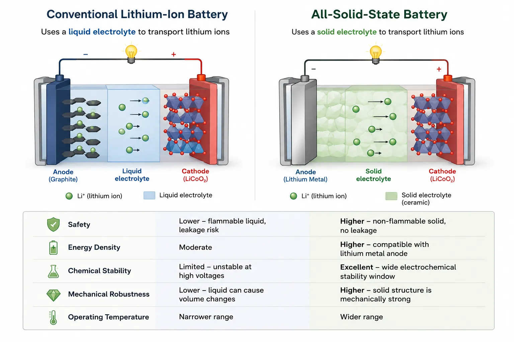
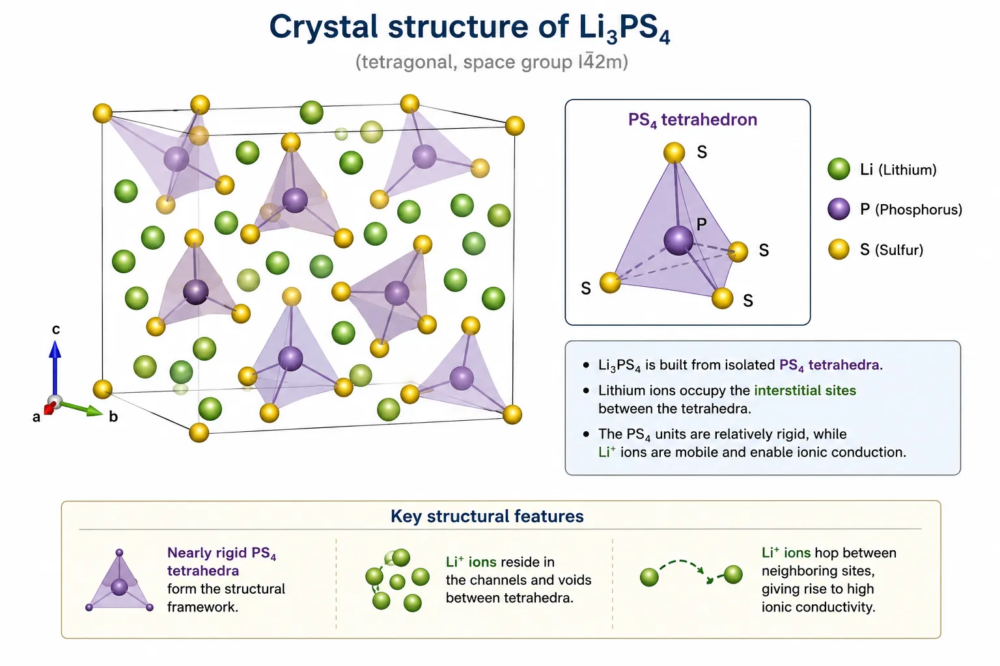

Link to final progress report: <a href="https://drive.google.com/file/d/1jv7VuudVk6tpwnwzF_8jWgYzpTixrI9U/view?usp=drive_link" target="_blank" rel="noopener noreferrer">English</a> | <a href="https://drive.google.com/file/d/1FNg7JPFEdx1W8FKnacMx54nDbjT7xQ1Y/view?usp=drive_link" target="_blank" rel="noopener noreferrer">Japanese</a>

## Important Note
**This article was written and all the images were generated with the help of ChatGPT to faithfully and pedagogically reproduce my own work.**

## Why Solid-State Batteries?

Rechargeable lithium-ion batteries have become an indispensable part of modern life. They power everything from smartphones and laptops to electric vehicles and grid-scale energy storage systems. Yet despite their ubiquity, the search for better batteries remains one of the most active areas of materials research.

The reason is simple.

The batteries we use today are already excellent—but they are far from perfect.

Commercial lithium-ion batteries rely on **liquid organic electrolytes** to transport lithium ions between the two electrodes. These liquids possess high ionic conductivity, allowing batteries to charge and discharge efficiently. However, they also introduce a number of problems.

Liquid electrolytes are flammable.

They can leak.

They are chemically unstable at sufficiently high voltages.

Under extreme conditions they may even contribute to thermal runaway, one of the major safety concerns associated with modern lithium-ion batteries.

As batteries become larger and more energy-dense, these issues become increasingly significant.

This naturally leads to an appealing question.

> What if we could replace the liquid electrolyte with a solid?

Replacing the electrolyte with a solid immediately eliminates leakage while significantly improving the mechanical robustness of the battery. Solid electrolytes are also compatible with lithium metal anodes, potentially enabling batteries with much higher energy densities than current commercial technologies.

This idea forms the foundation of the **all-solid-state battery**.



Unfortunately, replacing a liquid with a solid introduces an entirely new challenge.

### The Challenge of Ionic Conduction

When we think of electrical conduction, we usually imagine electrons flowing through a metal wire.

Solid electrolytes behave very differently.

Instead of electrons carrying charge, it is the **lithium ions themselves** that migrate through the crystal.

The surrounding atoms barely move.

Only the lithium ions hop between neighbouring atomic sites.

One way to picture this is to imagine a city.

The buildings remain fixed.

The roads remain fixed.

Only the cars move.

Similarly, the crystal lattice provides the framework, while lithium ions navigate through the spaces available within it.

The efficiency of this motion determines the ionic conductivity of the material.

:::important
A good solid electrolyte should possess three key properties.

- High ionic conductivity.
- Negligible electronic conductivity.
- Excellent chemical and mechanical stability.

Finding materials that simultaneously satisfy all three requirements is remarkably difficult.
:::

The first requirement is perhaps the most surprising.

Crystals are usually associated with rigidity and order.

Intuitively, one might expect such highly ordered structures to impede atomic motion.

Yet some crystalline materials allow lithium ions to move almost as freely as they do in liquids.

Understanding how this is possible has become one of the central questions in the field of solid-state ionics.

## Meet Li$_3$PS$_4$

Among the numerous solid electrolytes investigated over the years, lithium thiophosphates have emerged as one of the most promising families of materials.

One of the simplest members of this family is

$$
\mathrm{Li_3PS_4}.
$$

Although its chemical formula appears simple, Li$_3$PS$_4$ exhibits remarkably rich structural behaviour.

Its relatively high ionic conductivity, combined with its comparatively simple chemistry, has made it an ideal model system for studying lithium-ion transport in solids.



### A Crystal Built from Tetrahedra

The crystal structure of Li$_3$PS$_4$ is dominated by nearly rigid **PS$_4$ tetrahedra**.

Each phosphorus atom sits at the centre of a tetrahedron formed by four sulphur atoms.

These tetrahedra act as the structural backbone of the material.

Lithium ions occupy the spaces between them.

Unlike the relatively immobile PS$_4$ units, lithium ions are free to hop between neighbouring sites when sufficient thermal energy is available.

Every successful hop contributes to ionic conduction.

The arrangement of these tetrahedra therefore determines the pathways available for lithium-ion diffusion.

Even subtle structural changes can dramatically alter the ease with which lithium ions move through the material.

:::tip
In many fast-ion conductors, the rigid framework and the mobile ions play distinct roles.

The framework provides structural stability.

The mobile ions carry electrical charge.
:::

### One Compound, Multiple Structures

Another intriguing feature of Li$_3$PS$_4$ is that it does not exist in a single crystal structure.

Instead, it exhibits several **polymorphs**, including the well-known $\alpha$, $\beta$, and $\gamma$ phases.

These polymorphs have identical chemical compositions.

Only the arrangement of atoms differs.

This seemingly small difference can significantly influence ionic conductivity because each crystal structure provides a different network of diffusion pathways.

At this point, it is tempting to assume that the crystal structure with the lowest diffusion barrier must always be the best ionic conductor.

For a long time, this was a perfectly reasonable assumption.

Experiments, however, would eventually reveal something far more interesting.

## From Crystals to Glasses

When a molten material cools sufficiently slowly, its atoms have enough time to organise themselves into an ordered crystal.

```text
Liquid
   │
Slow cooling
   │
Crystal
```

Rapid cooling produces an entirely different outcome.

The atoms lose mobility before they can arrange into a periodic lattice.

Instead, they become frozen in a disordered configuration.

The resulting material is known as an **amorphous glass**.

```text
Liquid
   │
Rapid quench
   │
Glass
```

This process is called **melt quenching**.

Although glasses lack long-range crystalline order, they are nevertheless genuine solids.

Their atoms simply occupy disordered positions rather than repeating periodically throughout the material.

Li$_3$PS$_4$ can also be prepared in this amorphous form.

Initially, researchers viewed the crystalline and amorphous phases as two competing forms of the same material.

Naturally, they began asking a straightforward question.

Which one is the better ionic conductor?

The answer turned out to be unexpected.

Experiments suggested that the highest ionic conductivity was often observed **after the glass had partially crystallized**.

Instead of consisting entirely of crystalline regions or entirely of amorphous regions, the material contained a mixture of both.

This intermediate state became known as a **glass-ceramic**.

```text
Crystal
      │
 Melt
      │
Rapid quench
      │
Amorphous glass
      │
 Annealing
      │
Partial crystallization
      │
Glass-ceramic
```

Why should a material containing both order and disorder outperform either extreme?

At first glance, this seems almost paradoxical.

Introducing crystalline regions into a glass would appear to make lithium-ion motion more difficult, not easier.

Yet repeated experimental observations suggested otherwise.

Understanding this behaviour required something that experiments alone could not easily provide.

It required watching individual atoms move.

That is where molecular dynamics simulations enter the story.

## Following Atoms with Molecular Dynamics

Experiments had established an intriguing fact.

Partially crystallized Li$_3$PS$_4$ often exhibited higher ionic conductivity than either its fully crystalline or fully amorphous counterparts.

What they could not easily reveal was **why**.

Atomic rearrangements occur on length scales of a few ångströms and on timescales of femtoseconds. Capturing such processes experimentally is extremely challenging. While techniques such as X-ray diffraction and spectroscopy provide valuable structural information, they generally offer snapshots averaged over millions of atoms rather than the trajectory of each individual atom.

To understand how crystalline Li$_3$PS$_4$ transforms into an amorphous glass—and eventually begins to crystallize again—it is necessary to watch the atoms themselves.

This is precisely what **molecular dynamics (MD)** simulations allow us to do.

### What is Molecular Dynamics?

In a molecular dynamics simulation, every atom is treated as an individual particle whose motion is governed by Newton's equations of motion.

Starting from an initial atomic configuration, the force acting on every atom is calculated.

These forces determine how the atoms move during a very small interval of time, typically only a few femtoseconds.

The process is then repeated.

Millions of times.

The result is effectively a microscopic movie of the material evolving with time.

Instead of observing only the initial and final structures, we can follow every bond formation, every structural rearrangement, and every atomic diffusion event throughout the simulation.

:::note
Molecular dynamics does not assume how atoms should move.

Their trajectories emerge naturally from the forces acting on them, making MD one of the most powerful techniques for studying microscopic processes in condensed matter.
:::

For melt-quench simulations, this approach is particularly attractive.

We can begin with a crystalline structure, heat it until the crystal melts, rapidly cool it back to room temperature, and observe how an amorphous network gradually forms.

The simulation mirrors the same sequence of steps performed experimentally.

### The Computational Challenge

Although the basic idea is straightforward, accurately calculating the forces between atoms is considerably more difficult.

One possibility is to perform the calculation using **Density Functional Theory (DFT)**.

DFT provides highly accurate interatomic forces by solving the electronic structure of the system.

For many problems, it represents the gold standard of atomistic simulations.

However, this accuracy comes at a substantial computational cost.

A typical melt-quench simulation requires several hundred picoseconds of simulation time while containing hundreds or even thousands of atoms.

Performing such calculations entirely with DFT would demand an impractical amount of computational resources.

For this reason, researchers increasingly rely on **machine-learning interatomic potentials**.

These models are first trained using a large dataset of DFT calculations.

Once trained, they reproduce DFT-quality forces at only a fraction of the computational cost.

This combination makes it possible to simulate systems that would otherwise be far beyond the reach of conventional first-principles calculations.

## My Internship Project

During the summer of 2021, I joined the **Watanabe Laboratory** at the University of Tokyo through the ESEP-G internship programme.

The laboratory had already developed a **neural-network potential (NNP)** for Li$_3$PS$_4$, trained on DFT data spanning temperatures up to approximately 4000 K. This potential could be coupled with the molecular dynamics package **LAMMPS**, enabling large-scale melt-quench simulations that would have been prohibitively expensive using direct DFT calculations alone.

Rather than developing the neural-network potential itself, my work focused on using it to construct a reliable simulation workflow for melt quenching.

The broader objective was to establish a computational framework capable of generating realistic amorphous structures and, eventually, studying annealing-induced partial crystallization.

The project naturally broke down into a series of scientific questions.

- Can crystalline Li$_3$PS$_4$ be reliably transformed into an amorphous structure?
- How sensitive is the final structure to the cooling rate?
- Does the size of the simulation cell influence the results?
- How important is the material density?
- What melting temperature produces physically meaningful structures?
- Can subsequent annealing initiate partial crystallization?

Each of these questions required a careful series of simulations rather than a single calculation.

### Simulating Melt Quenching

The simulation workflow closely followed the experimental process used to produce glassy materials.

Starting from crystalline Li$_3$PS$_4$, the system was first heated to a high temperature until the long-range crystal structure disappeared.

Once the material had melted, it was cooled back to room temperature at a prescribed cooling rate.

The final atomic configuration represented a computationally generated amorphous structure.

```text
Crystalline Li$_3$PS$_4$
          │
      Heating
          │
      Liquid state
          │
 Rapid cooling
          │
 Amorphous Li$_3$PS$_4$
          │
(Optional)
 Annealing
          │
Partial crystallization
```

Although this workflow appears straightforward, every stage contains important parameters that influence the final structure.

Cooling too quickly may trap unrealistic atomic arrangements.

Cooling too slowly greatly increases the computational cost.

Similarly, the melting temperature must be high enough to destroy the crystalline order, but not so high that chemically meaningful structural units themselves begin to break apart.

Finding this balance became one of the central themes of my internship.

## Understanding the Generated Structures

Producing an amorphous structure is only the first step.

The next challenge is determining whether the generated structure is physically reasonable.

Unlike crystals, glasses possess no repeating unit cell.

Visual inspection alone is therefore insufficient.

Instead, structural analysis tools must be used to quantify the degree of order within the material.

### Radial Distribution Functions

One of the most widely used descriptors in molecular dynamics is the **radial distribution function (RDF)**.

The RDF measures how likely it is to find another atom at a given distance from a reference atom.

For crystalline materials, the RDF contains sharp peaks extending over long distances, reflecting the periodic arrangement of atoms.

Amorphous materials display a very different behaviour.

Only the nearest neighbours remain well defined.

Beyond that, the long-range peaks gradually disappear, indicating the absence of crystalline order.

Comparing RDFs before and after melt quenching therefore provides a straightforward way to verify whether the crystal has successfully transformed into an amorphous glass. During the internship, RDF analysis formed one of the primary tools used to characterise the simulated structures.

### Tracking Structural Units

The local chemistry of Li$_3$PS$_4$ is dominated by **PS$_4$ tetrahedra**.

During melting and quenching, however, these tetrahedra can undergo structural rearrangements, producing species such as P$_2$S$_7$ and P$_2$S$_6$.

Monitoring the populations of these structural units therefore provides another useful measure of how the material evolves throughout the simulation.

To identify these units automatically, the generated structures were analysed using custom Python scripts together with the **pyscal** library, allowing the evolution of the local atomic environment to be quantified throughout the melt-quench process.

## Asking the Right Questions

By this stage, a reliable melt-quench workflow had been established.

The next challenge was to determine **how sensitive the generated structures were to the simulation conditions**.

Unlike many computational studies where a single set of parameters is chosen at the outset, molecular dynamics simulations often require careful validation. Small changes in the simulation protocol can produce noticeably different atomic structures, making it essential to understand which parameters genuinely influence the results.

Throughout my internship, I therefore investigated several aspects of the simulation workflow, gradually refining it into a robust and reproducible procedure.

### Does the Cooling Rate Matter?

In an experimental melt-quench process, the cooling rate determines how much time atoms have to reorganize as the liquid solidifies.

The same principle applies in molecular dynamics.

If cooling occurs extremely rapidly, atoms become frozen before they can reach energetically favourable configurations.

Slower cooling allows additional structural relaxation, although at the expense of considerably longer simulation times.

To understand this trade-off, melt-quench simulations were performed using several different cooling rates.

Rather than relying solely on visual inspection, the resulting structures were analysed by monitoring the number of intact PS$_4$ tetrahedra after quenching. Since PS$_4$ units form the fundamental building blocks of Li$_3$PS$_4$, their population provides a convenient measure of how successfully the local chemistry is preserved throughout the simulation.

The objective was not simply to identify the "fastest" cooling protocol, but to determine a cooling rate capable of producing physically meaningful amorphous structures while remaining computationally practical.

### Does Simulation Size Matter?

Computational resources inevitably limit the size of molecular dynamics simulations.

However, systems that are too small may fail to represent the behaviour of bulk materials accurately.

To investigate finite-size effects, simulations were carried out using multiple supercell dimensions, with particular emphasis on $\(2 \times 2 \times 2\)$ and $\(3 \times 3 \times 4\)$ supercells. These larger cells contain significantly more atoms and therefore provide a better approximation to the behaviour of macroscopic Li$_3$PS$_4$.

Comparing structures generated using different cell sizes helped establish whether the observed structural characteristics were intrinsic to the material or merely artefacts arising from an insufficiently large simulation domain.

This step was particularly important because future studies of crystallization require enough space for ordered regions to emerge naturally within the simulation cell.

### The Role of Density

Another important variable is the density of the simulated material.

Changing the density effectively changes the average spacing between atoms, which can influence both local bonding and long-range structural relaxation during melt quenching.

To explore this effect, simulations were performed using three different densities. The resulting structures were then compared to determine how sensitive the amorphous network was to changes in volume.

Although density is often treated as a fixed material property, examining its influence helped ensure that the generated structures were not dependent on an arbitrary simulation choice.

Instead, the goal was to identify simulation conditions that consistently reproduced realistic amorphous Li$_3$PS$_4$.

### Choosing the Right Melting Temperature

One of the most informative observations during the internship concerned the melting temperature itself.

Initially, the simulations employed a melting temperature of **2500 K**.

While this temperature successfully destroyed the crystalline order, closer inspection revealed an unexpected problem.

The PS$_4$ tetrahedra themselves began to collapse.

Since these tetrahedra are the defining structural units of Li$_3$PS$_4$, their destruction indicated that the system was no longer faithfully representing the chemistry of the material. Rather than simply melting the crystal, the simulation was beginning to alter its fundamental building blocks.

This prompted a reassessment of the simulation protocol.

Lower melting temperatures, including 2000 K, 1500 K, and even lower values, were subsequently explored to identify conditions under which the crystal structure would melt while preserving the integrity of the PS$_4$ units.

This refinement proved to be one of the most valuable outcomes of the project.

It illustrated an important lesson that extends well beyond Li$_3$PS$_4$.

A simulation should not merely produce the desired final state.

It should also reproduce the correct underlying physics throughout the process.

## Towards Partial Crystallization

Having established a reliable melt-quench procedure for generating amorphous Li$_3$PS$_4$, the natural next step was to investigate what happens when the glass is heated again.

Instead of melting the material completely, the amorphous structures were subjected to **annealing** simulations.

The expectation was that thermal energy would allow atoms to rearrange locally, gradually initiating the formation of crystalline regions within the otherwise amorphous network.

This is precisely the process believed to produce glass-ceramic Li$_3$PS$_4$ experimentally.

Several annealing simulations were performed at different temperatures and durations.

During these studies, some simulations exhibited unphysical behaviour, such as a noticeable unidirectional drift of atoms, indicating that the annealing protocol required further refinement. Other simulations successfully generated stable amorphous structures that could serve as suitable starting points for future crystallization studies.

Although clear evidence of partial crystallization had not yet been confirmed by the conclusion of my internship, the computational framework required to investigate it had largely been established. The remaining challenge was to analyse the annealed structures in sufficient detail to identify the onset of crystallization.

## Looking Back

Looking back, the internship was far more than an introduction to molecular dynamics simulations.

It was my first opportunity to experience how computational materials research is conducted in practice.

Rather than obtaining a single "correct" result, the project involved repeatedly questioning the simulation protocol itself. Every parameter—cooling rate, system size, density, melting temperature, and annealing conditions—had to be examined carefully before the resulting structures could be interpreted with confidence.

Along the way, I became familiar with **LAMMPS** for large-scale molecular dynamics simulations, **OVITO** for visualizing atomic structures, and Python-based tools for analysing simulation data. More importantly, I developed an appreciation for how computational workflows are constructed, validated, and refined before they are used to answer scientific questions.

Although my internship concluded before the investigation of partial crystallization was complete, the work formed an important step towards that broader objective. Establishing a robust melt-quench workflow, identifying suitable simulation parameters, and initiating annealing studies provided the computational foundation for future investigations into the structural evolution of Li$_3$PS$_4$ and its remarkable ionic transport properties.

For me personally, the project marked my first exposure to large-scale atomistic simulations and machine-learning-assisted materials modelling. It was an experience that deepened my interest in computational condensed matter physics and demonstrated how modern simulation techniques can be used to explore phenomena that are often inaccessible to experiments alone.

## Where This Work Led

My internship concluded before the investigation of partial crystallization was complete. At that stage, the primary objective had been to establish a reliable molecular dynamics workflow capable of generating realistic amorphous Li$_3$PS$_4$ structures and to begin exploring annealing protocols that could induce crystallization.

The computational framework developed during this work later became part of a broader research effort within the Watanabe Laboratory. Building upon these simulations, subsequent studies investigated the structural evolution of annealed Li$_3$PS$_4$ in greater detail and analysed how increasing crystallinity influences lithium-ion transport.

One of the most important findings from this later work was that lithium diffusion does not occur predominantly at the interfaces between crystalline and amorphous regions, as had often been assumed. Instead, molecular dynamics simulations showed that lithium ions preferentially diffuse through the newly formed crystalline regions. As these regions grow and eventually connect to form a continuous network, they provide long-range pathways for ionic transport. This mechanism, known as **percolation conduction**, offers a microscopic explanation for the enhanced ionic conductivity observed in partially crystallized Li$_3$PS$_4$ glass-ceramics.

These findings were eventually published in *The Journal of Physical Chemistry C* as <a href="https://doi.org/10.1021/acs.jpcc.4c01076" target="_blank" rel="noopener noreferrer">*Enhanced Ionic Conductivity Through Crystallization of Li$_3$PS$_4$ Glass by Machine Learning Molecular Dynamics Simulations*</a> (2024), on which I am a co-author.

Looking back, it is rewarding to see how the simulations and workflow developed during my internship contributed to a larger scientific effort. What began as a project focused on constructing reliable melt-quench molecular dynamics simulations ultimately became part of a study that provided new atomistic insight into one of the most intriguing questions in solid-state ionics: why partially crystallized solid electrolytes can outperform both fully crystalline and fully amorphous materials.